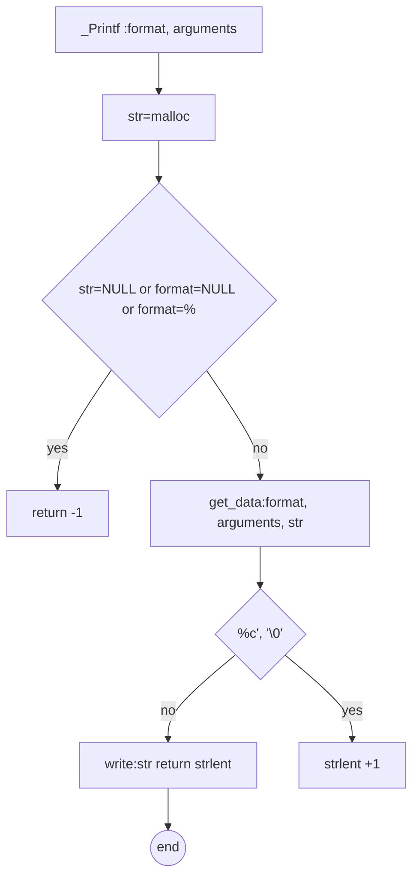

# Welcome to my README
Hello, I want to give you a tour of the **_printf** function, I guess you wonder what it's about.
Well, this function prints everything you want, and it will show it to you on your console.
It is wonderful, it was made with a lot of effort and love, I hope you try it and you like it a lot.

I'm going to start this tour by showing the different files that have the **_printf** function.
# main.h
This wonderful header file contains all the **function prototypes and structure definitions** that _printf uses to do its magic.
The file is used to share information between different code files.
Now you will wonder how the other files know that the definitions of the functions are in the **main.h**?
Well the trick is to use a directive called **#include "main.h"** at the beginning of each file.
Let's go for the next file!!
# spells.c
This file contains all the spells that _printf will cast to do its magic.
In other less fun words, this file contains all the functions that printf will use later to solve various problems. _printf will call the corresponding function at the appropriate time to print what you order.
His three main spells are as follows

### void datac (va_list arguments, char *str)
This function or as I like to call it "spell", needs two secret ingredients to work.
a list of variable arguments and a pointer of type char.
I imagine you wonder, yes, but what does this function do?
Well I'll tell you, this function saves data of type char in the str pointer, to be able to print it later.

### void datas (va_list arguments, char *str)
For this function guess what!! They need the same ingredients as the previous function, the difference is that this function saves a different type of data, do you know what it is?
Exactly what you are thinking! Stores a pointer type data.
What does this mean?
It is very simple, inside str the conten of another pointer will be stored, which points to the address where a string is stored.
I know it looks like a tongue twister, that's the power of this spell.

### void datap (va_list arguments __attribute__((unused)), char *str)
Now I present to you the last spell.
This function uses the same ingredients as the previous functions, only this function has a **__attribute__((unused))** trick.
what do you think it means?
Well this __attribute__((unused)) is used to indicate that the argument list may or may not be used.
Additionally, this function saves a different type of data, it saves a percentage "%" When the function finds two percentages "%%", it replaces them with only one %.

# wizard.c
I present to you the magician **int _printf(const char *format, ...)**
This file is our wizard, or in less funny words, here is our main _printf function.
From this file all the functions mentioned before and those that will come later are called as well.
Let's remember that the _printf function prints an output according to the type of data that can be data type char, data type pointer and data type percentage %.
# magic_wand.c
In this file you will find three functions
But the most important function is the **get_data** function.

### void get_data(const char *format, va_list arguments, char *str)
This get_data function is the magic wand of this great wizard.
I know you want to know why?
Well, the get_data function looks for all the functions and executes them when the wizard gives the command.
In short, this function looks for the function corresponding to the type of data you want to print, then executes that function, passes the result to the _printf function and prints it there.

### fun *get_struct(void)
This function returns a structure, it is like a data table or matrix, where you can find all the data types and their corresponding function.
This function returns the function corresponding to the type of data that the user wants to print.
Yes I know, this definition was a bit boring, ironically not everything can be **fun.**

### void moverstr(char *str, char format)
This function likes to make the string pointer angry. Because every so often it asks str for permission to save its arguments.
Seriously though, this means that this function moves the null symbol (end of string '\0'), to save each element it finds in the format pointer.

# Welcome to my FLOWCHART
### _printf function


### get_data function
```mermaid
graph TD
A[get_data: format, arguments, str] --> B{format i != NULL && format i != '\0'}
B -- no --> C((end))
B -- yes --> D{format i == '%'}
D -- yes --> F[select the right function for format i + 1 and execute it]
F --> G{there was a function for format i+1}
D -- no --> E[str = str + format]
E --> B
G --no-->H[str = str + format i]
H -->B
G --yes-->B
